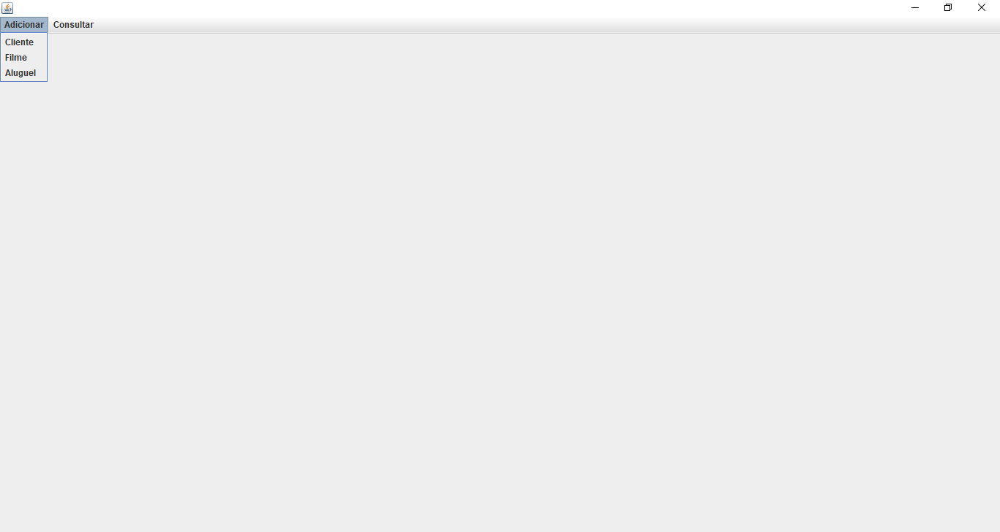
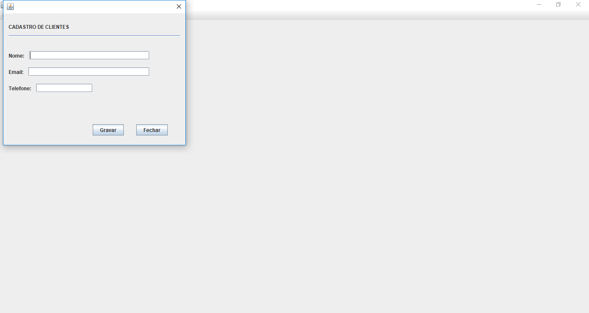
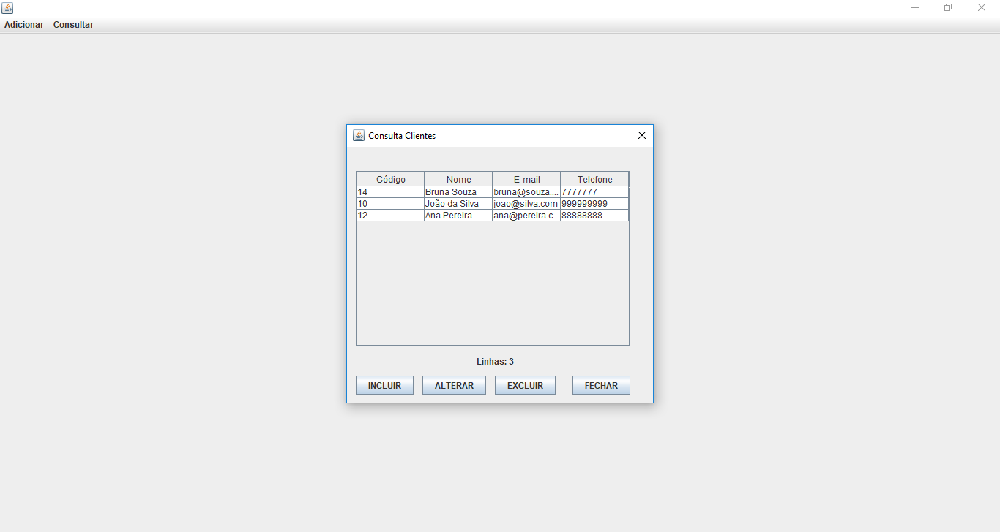
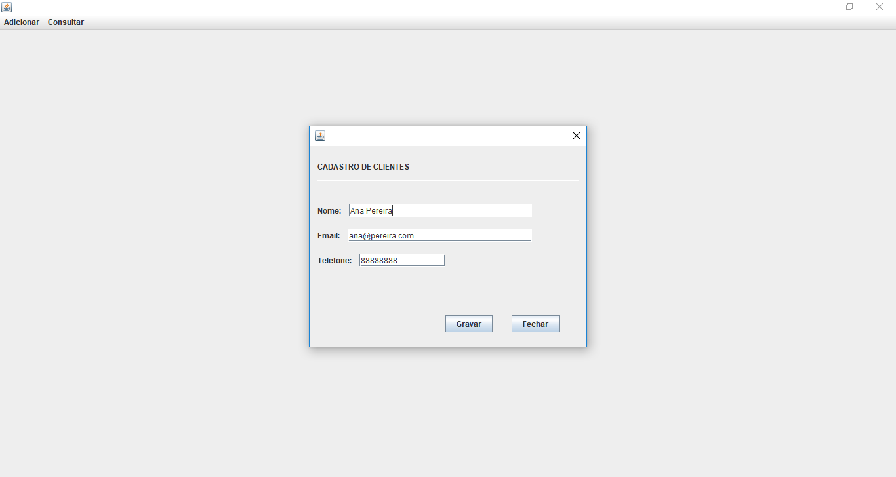
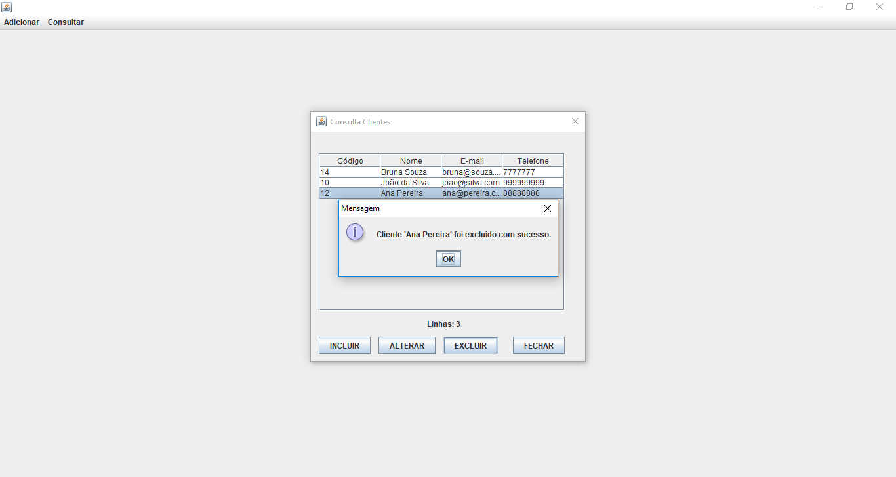

# Locadora

Trabalho acadêmico de uma locadora, desenvolvido em Java.
O objetivo desse projeto é mostrar os conhecimentos em Java Desktop e Oracle.

## Características

- CRUD
- Bean
- DAO
- Factory
- JOptionPane

## Requisitos

- NetBeans
- Java JDK 1.8
- Oracle XE

## Tecnologias

- Java
- Swing
- Oracle

## Instalação

```
$ git clone https://github.com/danilomeneghel/locadora.git

$ cd locadora

```

Abra seu banco Oracle e importe o arquivo locadora.sql que está na raiz.

## Licença

Projeto licenciado sob <a href="LICENSE">The MIT License (MIT)</a>.

## Screenshots

<br><br>
<br><br>
<br><br>
<br><br>
<br><br>
